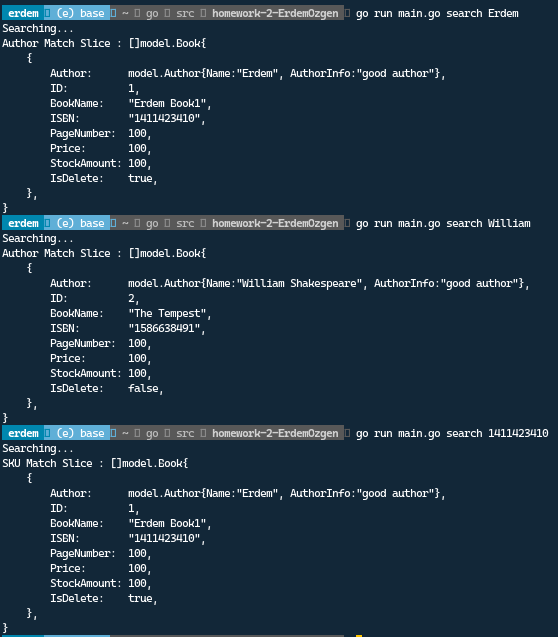
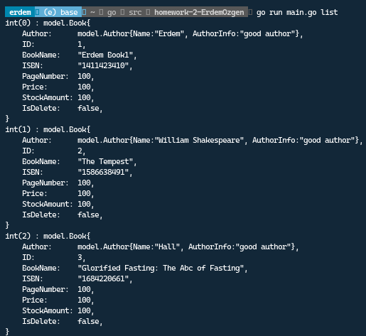

This is second assignment for picus patika.dev.

# How to install ?

```bash
go get ./...
go install 
homework-2-ErdemOzgen

```

# How it works ?

1. Use this for help functionality
```bash
homework-1-ErdemOzgen -h
```


2. Use this for search 3 other features like AuthorName, Book Title and ISBN
```bash
homework-2-ErdemOzgen search Erdem # Change Erdem to other author name.
homework-2-ErdemOzgen search Erdem Book1 # Change Book title
homework-2-ErdemOzgen search 1411423410 # Change ISBN number
```


3. Use this for buy function
```bash
homework-2-ErdemOzgen buy 1 15 #takes id and amount. also returns error if id 1 is deleted
homework-2-ErdemOzgen buy 45 12 # Id not in range error
homework-2-ErdemOzgen buy 1 1000 # Not enough in stocks error

```


4. Use this for list all books that not deleted
```bash
homework-2-ErdemOzgen list 
```



5. Use this for delete books by id
```bash
homework-2-ErdemOzgen delete 1 # takes Id and delete
 homework-2-ErdemOzgen delete 13424 # id is not in range error also return error if already deleted 
```
